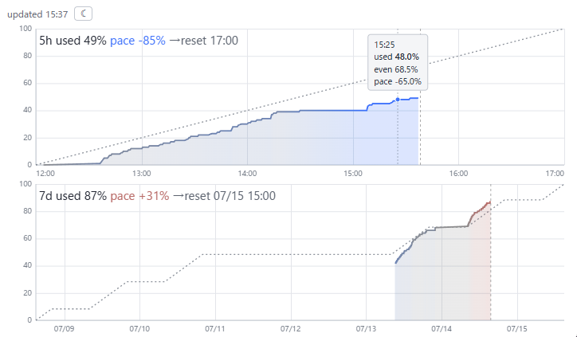

# claude-token-pace

*[日本語](README.md) | English* ・ version **0.1.3** (SemVer)

An interactive, browser-based viewer for your Claude Code **token consumption pace** (the 5-hour and 7-day rate-limit `used%`). It serves a small page over local HTTP and shows how far you are **ahead of or behind the even pace**, in both color and numbers.



- **used line**: rate-limit usage (%). Colored by pace deviation: blue (behind) → gray (on pace) → red (ahead).
- **even pace (dotted)**: the standard consumption pace. Linear for 5h, a business-hours staircase for 7d.
- **now line**: current time (updated every second). Hover to read used / even / pace deviation at any point.

Top panel = 5h window (the 5 hours until the next 5h reset), bottom panel = 7d window (the 7 days until the next 7d reset).

## Requirements
- **OS**: Linux / macOS / WSL2 (**native Windows is not supported**)
- **Dependencies**: `python3`, `jq`, and a web browser
- Rate-limit (5h/7d window) data is available on **Claude.ai subscription plans that have the 5-hour / 7-day usage limits (Pro / Max / Team, …)**, and only **once Claude Code has that data** (i.e. after your first model response; until then the viewer shows "collecting…").

## Install
### Option A: one-liner (curl → bash, recommended)
```bash
curl -fsSL https://raw.githubusercontent.com/k-tashiro-arent/claude-token-pace/main/bootstrap.sh | bash
```
It clones the repo into a temp dir and runs the installer (needs `git`, `python3`, `jq`). To pin a version:
```bash
curl -fsSL https://raw.githubusercontent.com/k-tashiro-arent/claude-token-pace/main/bootstrap.sh | TOKEN_PACE_REF=v0.1.0 bash
```

### Option B: git clone (if you want to update via `git pull`)
```bash
git clone https://github.com/k-tashiro-arent/claude-token-pace.git
cd claude-token-pace
./install.sh
```

Either way, the installer:
1. Places scripts/viewer under `~/.claude/token-pace/`
2. Installs default `config.json` / `biz-hours.json` (existing files are kept)
3. Adds the `/tpw` slash command to `~/.claude/commands/`
4. **Wraps your statusLine** (backing up `settings.json`). The wrapper feeds the statusLine JSON to the sampler **while passing your existing statusLine output through unchanged**.

> To install elsewhere: `TOKEN_PACE_DIR=/path/to/dir ./install.sh`

## Update
- **curl method**: just re-run the same one-liner (it re-clones and re-installs each time).
- **git clone method**: refresh the clone and re-run:
  ```bash
  cd claude-token-pace
  git pull
  ./install.sh
  ```

`install.sh` is idempotent: it overwrites the program (`bin/`, `index.html`), keeps your settings (`config.json`, `biz-hours.json`), and leaves the statusLine untouched if it is already wrapped. On update it prints `vOLD → vNEW` (the installed version is recorded in `~/.claude/token-pace/.version`).

## Usage
In Claude Code:
```
/tpw
```
A local HTTP server (`127.0.0.1`) starts and the viewer opens in your default browser. The viewer auto-refreshes every few seconds.

## Data collection & accumulation
- Usage is recorded **automatically while you use Claude Code** (on each update of Claude Code's status line / `statusLine`). Sampling is throttled to about once per 30 s, and the graph (`pace.json`) is regenerated about every 3 minutes.
- Recording begins **once Claude Code has the rate-limit data** — i.e. after your first model response (until then the viewer shows "collecting…"); nothing is recorded while idle, because usage does not change then.
- The 5h/7d limits are **per account (user), not per session**. With several concurrent sessions, each session's status line writes to the **same** `pace.jsonl`, so the recorded value is always your account-wide usage (more sessions just means more frequent sampling).
- Data accumulates **locally, per installed environment** (`~/.claude/token-pace/pace.jsonl`). History is not shared across machines — each environment builds its own. Right after install there is no history, so the panels (especially the 7-day one) fill in as you keep using Claude Code.

## Configuration
### Port (`~/.claude/token-pace/config.json`)
```json
{ "port": 8799 }
```
Resolution order: env `TOKEN_PACE_PORT` > `config.json` `port` > default `8799`. The preferred port is tried first; if busy, nearby ports are scanned automatically.

### Business hours (`~/.claude/token-pace/biz-hours.json`)
The basis for the 7d panel's even pace.
```json
{ "biz_days": [1, 2, 3, 4, 5], "biz_start_hour": 9, "biz_end_hour": 18 }
```
- `biz_days`: working days (1=Mon … 7=Sun)
- `biz_start_hour` / `biz_end_hour`: working hours (JST, decimals allowed)

## Data location
`~/.claude/token-pace/` (`pace.jsonl` = records, `pace.json` = viewer input, `index.html`, config/state files). Bound to `127.0.0.1`, so it is never exposed to the LAN.

## Uninstall
```bash
bash ~/.claude/token-pace/uninstall.sh
```
Restores your statusLine, removes the `/tpw` command, and stops the running server (recorded data is kept; remove it fully with `rm -rf ~/.claude/token-pace`).

## Troubleshooting
- **Browser doesn't open**: uses `xdg-open` (Linux), `open` (macOS), `powershell.exe` (WSL). If none exist, open the printed URL manually.
- **Stuck on "collecting…"**: recording hasn't started yet (Claude Code hasn't received a response yet, or rate-limit data isn't available). Send a turn in Claude Code, wait a few minutes, and confirm your plan is supported (see Requirements).
- **Port in use**: the preferred port plus nearby ports are scanned automatically. Pin it via `config.json` `port`.

## License
[MIT](LICENSE)
