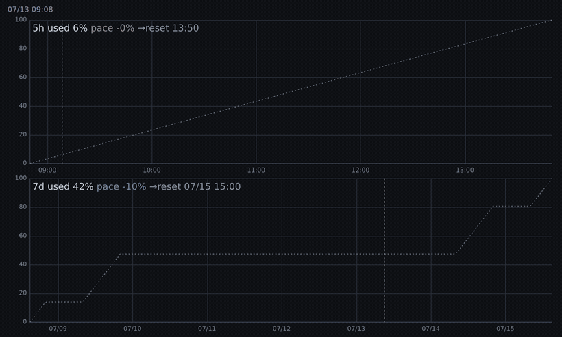

# claude-token-pace

*日本語 | [English](README.en.md)* ・ バージョン **0.2.0**（SemVer）

[](https://github.com/k-tashiro-arent/claude-token-pace/actions/workflows/ci.yml)
[](https://github.com/k-tashiro-arent/claude-token-pace/releases)
[](LICENSE)

Claude Code の**トークン消費ペース**（5時間枠・7日枠のレート制限 used%）を、ブラウザでインタラクティブに表示するツールです。ローカル HTTP で配信し、**標準ペース（even pace）との乖離**を色と数値で確認できます。



- **used 線**: レート枠の使用率（%）。pace 乖離に応じて 青（遅れ）〜灰（標準どおり）〜赤（先行）に着色。
- **even pace（点線）**: 標準消費ペース。5h は均等直線、7d は就業時間ベースの階段。
- **now 線**: 現在時刻（毎秒更新）。ホバーで各時点の used / even / pace 乖離を表示。

上段 = 5h 枠（次の 5h リセットまでの5時間）、下段 = 7d 枠（次の 7d リセットまでの7日間）。**月次クレジット枠（extra usage）が使えるアカウントでは 3 枚目**（次の月初リセットまで）も表示されます。

## なぜ便利か
- **既存の Claude サブスクだけで動く** — API キー不要・追加費用なし。Claude Code が既に持つレート制限データを読むだけ。
- **就業時間ベースの標準ペース** — 7日枠の even pace は平坦な直線ではなく勤務時間の階段。「今のペースは使いすぎか？」が実務的に分かる。
- **ローカル完結・非公開** — `127.0.0.1` のみにバインド。使用量データは各環境の手元にだけ蓄積し、LAN にも外部にも出さない（枠の取得だけは外へ読み取りリクエストが出ます。月次パネルは Anthropic の API へ直接、Codex パネルは `codex` 自身の app-server 経由。→[月次クレジット枠](#月次クレジット枠extra-usage) / [Codex のレート枠](#codex-のレート枠任意)）。

## 動作環境
- **OS**: Linux / macOS / WSL2（**Windows ネイティブは対象外**）
- **依存**: `python3`、`jq`、任意のブラウザ
- レート制限（5h/7d 枠）のデータは、**5時間・7日の使用量上限がある Claude.ai のサブスクリプション契約（Pro / Max / Team など）**で、かつ **Claude Code でそのデータが得られて以降**（＝最初の応答を受け取った後。それまではビューアが「データ収集中…」を表示）に取得できます。

## インストール
### 方法A: ワンライナー（curl→bash・推奨）
```bash
curl -fsSL https://raw.githubusercontent.com/k-tashiro-arent/claude-token-pace/main/bootstrap.sh | bash
```
内部でリポジトリを一時ディレクトリに clone し、install を実行します（依存: `git`・`python3`・`jq`）。固定版を入れるには:
```bash
curl -fsSL https://raw.githubusercontent.com/k-tashiro-arent/claude-token-pace/main/bootstrap.sh | TOKEN_PACE_REF=v0.1.0 bash
```

### 方法B: git clone（更新を `git pull` で行いたい場合）
```bash
git clone https://github.com/k-tashiro-arent/claude-token-pace.git
cd claude-token-pace
./install.sh
```

どちらの方法でも、インストーラは次を行います:
1. スクリプト/ビューアを `~/.claude/token-pace/` に配置
2. 既定の `config.json` / `biz-hours.json` を配置（既存があれば保持）
3. スラッシュコマンド `/tpw` を `~/.claude/commands/` に設置
4. **statusLine を「ラッパー」に差し替え**（`settings.json` をバックアップ）。ラッパーは statusLine の JSON を記録用サンプラに渡しつつ、**既存の statusLine 表示はそのまま通します**。

> 設置先を変えたい場合: `TOKEN_PACE_DIR=/path/to/dir ./install.sh`

## アップデート
- **curl 方式**: 同じワンライナーを再実行するだけ（毎回クローンし直して install）。
- **git clone 方式**: クローンを更新して再実行:
  ```bash
  cd claude-token-pace
  git pull
  ./install.sh
  ```

`install.sh` は冪等です。プログラム（`bin/`・`index.html`）を上書きし、あなたの設定（`config.json`・`biz-hours.json`）は保持し、statusLine は既にラップ済みなら変更しません。更新時は `v旧 → v新` を表示します（インストール版数は `~/.claude/token-pace/.version` に記録）。

## 使い方
Claude Code で:
```
/tpw
```
ローカル HTTP サーバ（`127.0.0.1`）が起動し、既定ブラウザでビューアが開きます。ビューアは数秒ごとに自動反映します。

## データの取得と蓄積
- 使用量は **Claude Code を使用している間、自動で**（ステータス行 statusLine が更新されるたびに）記録されます。記録は約 30 秒に 1 回へ間引かれ、グラフ（`pace.json`）は約 3 分ごとに再生成されます。
- 記録が始まるのは、**Claude Code で最初の応答を受け取り、レート枠のデータが得られてから**です（それ以前はビューアが「データ収集中…」を表示。アイドル中は使用量が変化しないため記録されません）。
- レート枠（5h/7d）は**アカウント（ユーザー）単位**で、複数セッションを並行して使っていても各セッションのステータス行が**同じ `pace.jsonl`** に書き込みます。記録は常にアカウント全体の使用率で、セッション間で分かれません（並行が多いほどサンプリング頻度が上がるだけ）。
- データは**インストールした環境ごとにローカルに蓄積**されます（`~/.claude/token-pace/pace.jsonl`）。複数マシンで使っても履歴は共有されず、各環境が独立に貯めます。インストール直後は履歴が無いため、特に 7d パネルは使い込むほど埋まっていきます。

## 月次クレジット枠（extra usage）

プラン枠を超えた分の支出（usage credits）は **statusLine の JSON に含まれない**ため、5h/7d と同じ経路では取得できません。そのためこのパネルだけは、Claude Code 自身が使うのと同じエンドポイントから取得します。

- 取得: `GET https://api.anthropic.com/api/oauth/usage` を**約 5 分に 1 回**（`bin/credits-fetch.py`）
- 認証: `~/.claude/.credentials.json`（`$CLAUDE_CONFIG_DIR` があればそちら）の OAuth アクセストークンを**読むだけ**。期限切れなら何もしません（トークンの更新は Claude Code 本体に任せます）
- 記録: `~/.claude/token-pace/credits.jsonl`（`{ts, used, limit, m1r}`。金額は API の最小単位＝USD なら cent）
- **リセットは UTC の月初**（日本時間では毎月 1 日 09:00）。API に月次枠の `resets_at` は無いため、この境界は実測に基づきます（2026-08-31 23:40 UTC に満額 → 2026-09-01 00:05 UTC に 0。ローカル月初の 09/01 00:00 JST を 8 時間 40 分過ぎた時点では未リセットでした）
- 取得できない環境（トークンがファイルに無い macOS の Keychain 保管、extra usage 非対応プランなど）では**何も記録されず、パネルも表示されません**（5h/7d は従来どおり動作します）

**注意**: このパネルの 100% は `monthly_limit`＝**支出上限**です。5h/7d の「使い切ってよい枠」とは意味が異なり、even pace ちょうど（灰色）は「月末に上限を使い切る軌道」を意味します。

## Codex のレート枠（任意）

[Codex CLI](https://github.com/openai/codex) を使っている環境では、その使用率も同じ画面に並べて表示できます。Codex には statusLine のような hook が無いため、**2 つの経路**で集めます（どちらも同じ `codex.jsonl` に書きます）。

**1. app-server に問い合わせる（`bin/codex-fetch.py`）**

- `codex app-server`（stdio の JSON-RPC）に `initialize` → `account/rateLimits/read` を投げ、応答から used% / 窓の長さ / リセット時刻だけを取ります
- TUI の `/status` と同じ経路なので、**会話をしていない期間でも現在値が取れます**。会話は発生しないのでトークンを消費しません（実測 約 1 秒）
- `codex` が PATH に無い環境では何もしません（`CODEX_BIN` でパスを指定できます）

**2. rollout ログを読む（`bin/codex-scan.py`）**

- 読む対象: `$CODEX_HOME`（既定 `~/.codex`）`/sessions/**/rollout-*.jsonl` の `token_count` イベント。ここに応答時点のレート枠がそのまま入っています
- 取り出すのは **`timestamp` と `rate_limits` の数値だけ**です。会話本文・ツール出力は読み取りもコピーもしません
- 読み込み済みバイト数を `.codex_scan.json` に持ち、**追記分だけ**を読みます（全走査は初回のみ・既定で 60 日前まで遡ります）
- 枠が載るのは会話が発生したときだけなので、これ単独では会話していない期間の現在値が取れません

共通:

- 記録: `~/.claude/token-pace/codex.jsonl`（`{ts, u, w, r}` ＝ used% / 窓の長さ(分) / resets_at。secondary があれば `u2, w2, r2` を追加）
- 収集はどちらも約 2 分に 1 回
- Codex が入っていない環境では何も記録されず、パネルも出ません

窓の長さは定数ではなく窓の長さの観測値から決めるので、枠の構成（5h+7d の 2 枠 / 7d の 1 枠）が変わっても追従します。1 日以内の窓は 5h と同じ均等直線、それより長い窓は 7d と同じ就業時間の階段を標準ペースにします。

**制限**: Codex 側のクレジット残高は取得できません（`credits.balance` が常に `null`）。月次パネルに相当するものは作れません。また、**使用率が 0% の間はリセット時刻が「今から 1 窓後」を返し続けるため窓が時間とともにスライドし、パネルには最新の 1 点しか出ません**（使用が始まるとリセット時刻が固定され、点が積み上がります）。枠を使い切ると枠の数値自体が返らなくなり、その間は記録されません。なお rollout ログも app-server のプロトコルも Codex CLI の内部仕様で、バージョンによって変わり得ます（読めなくなればパネルを出しません）。

## 設定
### ポート（`~/.claude/token-pace/config.json`）
```json
{ "port": 8799 }
```
解決順: 環境変数 `TOKEN_PACE_PORT` > `config.json` の `port` > 既定 `8799`。指定ポートを優先し、埋まっていれば近傍を自動スキャンして起動します。

### 就業時間（`~/.claude/token-pace/biz-hours.json`）
7d パネルの even pace（標準ペース）の基準です。
```json
{ "biz_days": [1, 2, 3, 4, 5], "biz_start_hour": 9, "biz_end_hour": 18 }
```
- `biz_days`: 就業曜日（1=月 … 7=日）
- `biz_start_hour` / `biz_end_hour`: 就業時刻（JST、小数可）

## データの場所
`~/.claude/token-pace/`（`pace.jsonl` = 記録、`credits.jsonl` = 月次クレジット枠、`codex.jsonl` = Codex のレート枠、`pace.json` = ビューア入力、`index.html`、各種設定・状態ファイル）。`127.0.0.1` バインドなので LAN には露出しません。

## アンインストール
```bash
bash ~/.claude/token-pace/uninstall.sh
```
statusLine を元に戻し、`/tpw` コマンドを削除、稼働中サーバを停止します（記録データは残します。完全削除は `rm -rf ~/.claude/token-pace`）。

## トラブルシューティング
- **ブラウザが開かない**: Linux は `xdg-open`、macOS は `open`、WSL は `powershell.exe` を使用。無い場合は表示された URL を手動で開いてください。
- **「データ収集中…」のまま**: まだ記録が始まっていません（Claude Code でまだ応答を受け取っていない/レート制限データ未取得）。Claude Code で1ターン操作して数分待ち、対象の契約か（「動作環境」を参照）も確認してください。
- **ポートが埋まっている**: 指定＋近傍を自動スキャンして起動します。固定したい場合は `config.json` の `port` を変更。

## ライセンス
[MIT](LICENSE)
